# platform-mcp

An [MCP](https://modelcontextprotocol.io) server over every platform-core
`BaseViewSet` resource, with OAuth sign-in (for Claude's connectors) and
personal access tokens (PATs) for MCP clients, and a frontend page to
manage both. A host app (GoalNexa's
`apps/main`) imports both halves:

- **Backend**: the `platform_mcp` Django app (`backend/`). The MCP
  endpoint gets `<resource>_schema/_list/_get/_create/_update/_delete`
  tools (plus `_link/_unlink` for many-to-many relations) for every
  registered resource, with nothing to write per resource.
- **Frontend**: the `platform-mcp-frontend` package (`frontend/`). One
  "MCP access" page to create and revoke tokens and disconnect apps,
  with setup steps for each client below, filled in with the server URL
  and the new token, plus the OAuth consent page.
- **Agent skills**: any installed app can ship `mcp_skills/<name>/SKILL.md`
  playbooks. The instance serves them, plus an index that doubles as a
  one-line install prompt (see "Agent skills" below).

## Using it with an AI client

The chat apps - Claude, ChatGPT, Gemini - sign in with OAuth, so
there's no token to create: add the server URL and approve the consent
page. Every other client uses a personal access token:

1. Sign in and open **MCP access** in the sidebar (`/mcp`).
2. Click **New token**, name it after the client (e.g. "Claude Code on
   my laptop"), pick an expiry, and copy the token. It's shown once.
3. Pick your client below. The page has the same steps as a wizard,
   with your server URL and token already filled in, and shows
   "Connected" as soon as the client reaches the server.

The server speaks MCP's **Streamable HTTP** transport at
`https://<your-host>/api/v1/mcp` and authenticates with OAuth or
`Authorization: Bearer <token>`. Below, `goalnexa` is the server name
and `gnx_...` the token. Replace both, and the URL.

A token acts as you: the assistant can read and change exactly what you
can in the app, and nothing else. Use one token per client so you can
revoke them one at a time. Tokens only work at the MCP endpoint, not
the rest of the API, and can't create or revoke other tokens.

<!-- clients:start -->
<!-- Generated from frontend/src/lib/clients.ts by `npm run readme` - edit that file, not this section. -->

Once connected, ask your assistant what it can do with the server:

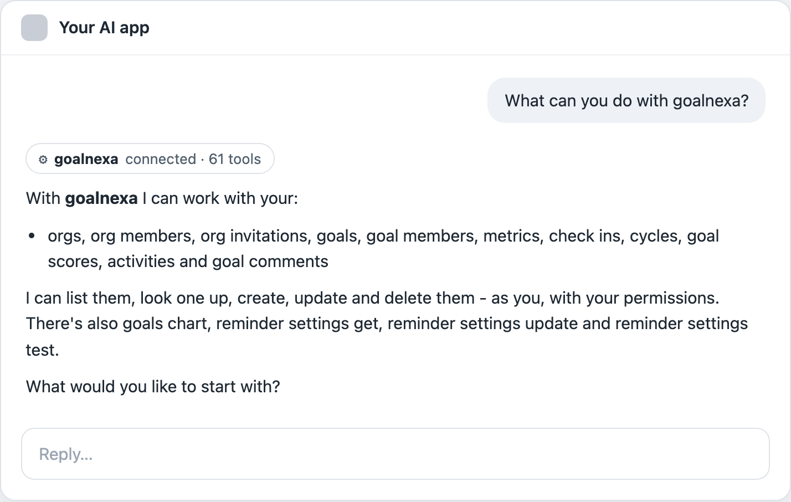

### Claude

claude.ai, the desktop app and the phone app - a custom connector. Signs in through the browser - no token. Works in: Web, Desktop, Phone.

1. In Claude - claude.ai or the desktop app - open Customize → Connectors, click Add, then “Add custom connector”. (Older versions: Settings → Connectors.)

   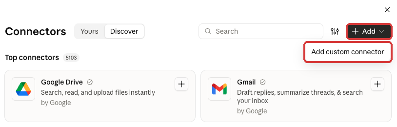

2. Name: `goalnexa`. MCP server URL - then click Continue: `https://your-host/api/v1/mcp`

   

3. Claude checks the server and shows sign-in settings: keep the ones it marks Detected - Authentication “Sign in now”, OAuth client “Register automatically”, no request headers. Don't pick “Use Claude's published identity”: this server doesn't support it. Then click Add.

   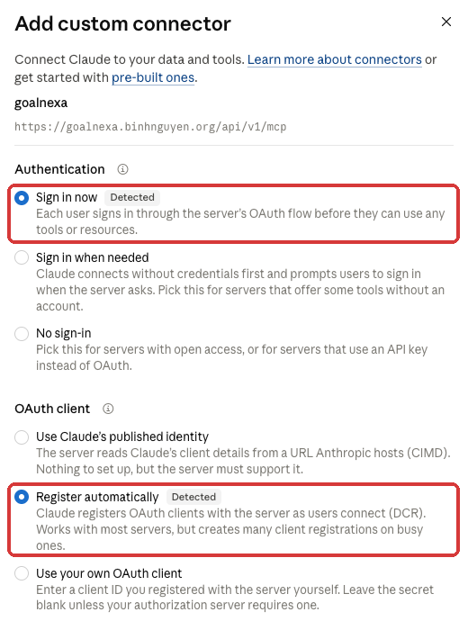

4. Click Connect. A window opens on your instance: sign in if asked, then click Allow.

   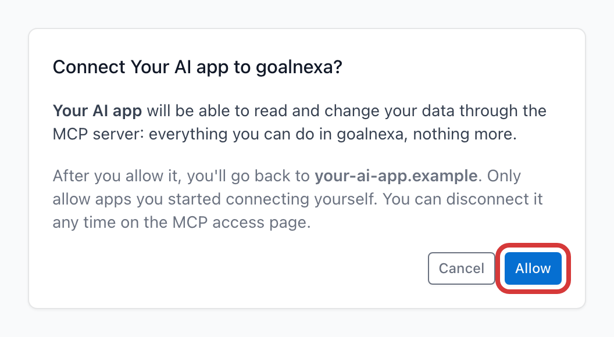

5. In a chat, open + → Connectors and turn it on.

   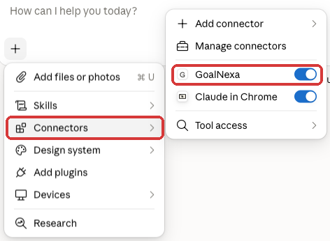

A connector added on claude.ai works in the desktop and phone apps too. On a Team or Enterprise plan, an owner adds it once under Organization settings → Connectors, then each member clicks Connect.

The server must be reachable from the internet over HTTPS: Claude connects from Anthropic's servers, not from your computer.

Check: Customize → Connectors shows it as connected, and it's listed under Connected apps on the MCP access page.

If it doesn't work:

- “Couldn't connect” right after Add: the URL must be public HTTPS - a localhost or LAN address can't be reached from Anthropic's servers.
- “A connector with this URL already exists”: it's already added - turn it on from + → Connectors in a chat.
- Connected but Claude never uses it: turn it on from + → Connectors in that chat, or name it in your prompt.

_Steps last checked 2026-10-02._

### ChatGPT

chatgpt.com - a custom MCP server, added as a plugin. Signs in through the browser - no token. Works in: Web.

Before you start:

- On Business and Enterprise, a workspace owner may need to allow custom MCP servers first.

1. On chatgpt.com, open Plugins in the sidebar, click Add, then “Add custom MCP server”.

   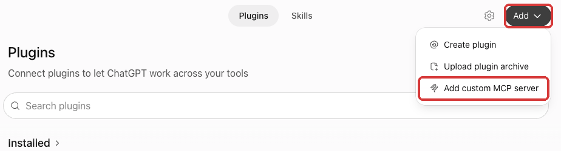

2. Name: `goalnexa`. Under Connection, keep Server URL and paste: `https://your-host/api/v1/mcp`

   

3. Authentication: OAuth. Tick “I understand and want to continue”, then click “Create as a plugin”.

   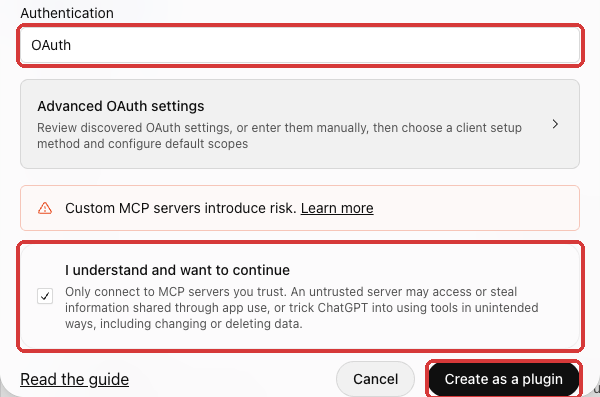

4. A window opens on your instance: sign in if asked, then click Allow.

   

5. In a chat, click + and pick the app, or name it in your prompt. ChatGPT asks before each change.

   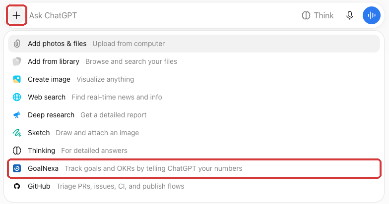

Check: Plugins lists it under Installed, and it's listed under Connected apps on the MCP access page.

If it doesn't work:

- No Plugins page or no “Add custom MCP server”: older accounts have it under Settings → Apps → Advanced settings → Developer mode, then Create.
- It reads but never changes anything: check the app's permission under Settings → Plugins (“Allow low-risk tools” asks before changes).
- Connected but never used: pick it from + in that chat, or name it in your prompt.

_Steps last checked 2026-10-10._

### Gemini

gemini.google.com and the Gemini phone app - a custom app. Signs in through the browser - no token. Works in: Web, Phone.

Before you start:

- A personal Google account (not work or school), 18 or older. Custom apps are still rolling out, so not every account has them yet.
- Keep Activity turned on (Gemini → Settings → Activity).

1. On a computer, open gemini.google.com → Settings (bottom left) → Personal Intelligence → Connected Apps.

   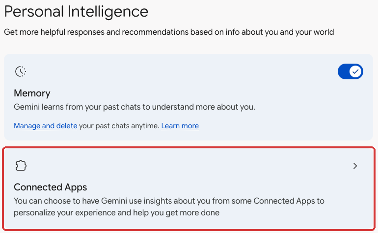

2. Under Custom apps, click “Add a custom app” and paste this URL exactly - no trailing slash: `https://your-host/api/v1/mcp`

   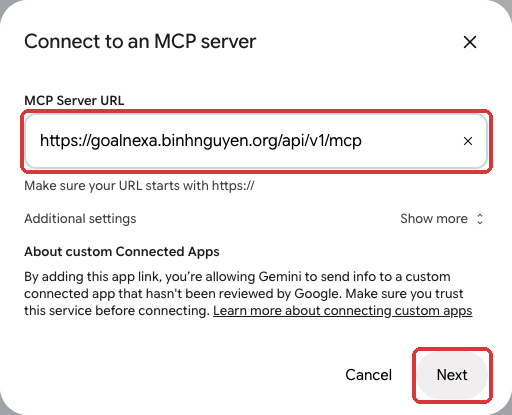

3. Click Next. A window opens on your instance: sign in if asked, then click Allow.

   

4. In a chat, type @ and pick the app. Once connected here it works in the Gemini phone app too. Gemini asks before each change.

   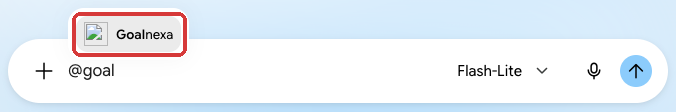

Check: Connected Apps lists it under Custom apps, and it's listed under Connected apps on the MCP access page.

If it doesn't work:

- No Personal Intelligence or Custom apps: the account doesn't have custom apps yet (see above) - they're still rolling out.
- “This MCP server is already connected”: it's already added - type @ in a chat to use it.
- Signed in, but Gemini does nothing with it: turn on Keep Activity.

_Steps last checked 2026-10-10._

### Cursor

A config file, all projects or one. Uses a personal access token. Works in: Desktop.

1. Add this to `~/.cursor/mcp.json` (all projects) or `.cursor/mcp.json` (one project).

```json
{
  "mcpServers": {
    "goalnexa": {
      "url": "https://your-host/api/v1/mcp",
      "headers": {
        "Authorization": "Bearer gnx_..."
      }
    }
  }
}
```

Check: Settings → MCP shows the server with a green dot and its tools.

_These steps haven't been tested end to end yet._

### VS Code

Copilot agent mode; the token goes in secret storage. Uses a personal access token. Works in: Desktop.

1. Add this to `.vscode/mcp.json` (or run “MCP: Open User Configuration”). VS Code asks for the token the first time and stores it securely, so it never sits in the file.

```json
{
  "inputs": [
    {
      "type": "promptString",
      "id": "goalnexa-token",
      "description": "goalnexa personal access token",
      "password": true
    }
  ],
  "servers": {
    "goalnexa": {
      "type": "http",
      "url": "https://your-host/api/v1/mcp",
      "headers": {
        "Authorization": "Bearer ${input:goalnexa-token}"
      }
    }
  }
}
```

Check: Run “MCP: List Servers”, start the server, and pick its tools in Copilot Chat's agent mode.

_These steps haven't been tested end to end yet._

### Windsurf

A config file for Cascade. Uses a personal access token. Works in: Desktop.

1. Add this to `~/.codeium/windsurf/mcp_config.json`, then refresh in Settings → Cascade → MCP servers.

```json
{
  "mcpServers": {
    "goalnexa": {
      "serverUrl": "https://your-host/api/v1/mcp",
      "headers": {
        "Authorization": "Bearer gnx_..."
      }
    }
  }
}
```

Check: The server shows up with its tools under Cascade's MCP servers.

_These steps haven't been tested end to end yet._

### Claude Code

One command; sign in through the browser or use a token. Uses a personal access token. Works in: Terminal.

1. Run this in a terminal. Add `--scope user` to use it in every project, or `--scope project` to share it with a repo through `.mcp.json`.

```shell
claude mcp add --transport http goalnexa https://your-host/api/v1/mcp \
  --header "Authorization: Bearer gnx_..."
```

2. Or leave out `--header` and no token is needed: run `/mcp` in a session, pick the server and choose Authenticate to sign in through the browser.

With `--scope project`, keep the token out of the shared file: `"Authorization": "Bearer ${MCP_TOKEN}"` in `.mcp.json` is read from the environment.

Check: Run `claude mcp list`, or `/mcp` inside a session, and check the server shows as connected.

_These steps haven't been tested end to end yet._

### Codex CLI

A config file; the token comes from an environment variable. Uses a personal access token. Works in: Terminal.

1. Add this to `~/.codex/config.toml` (`codex mcp add <name> --url <url> --bearer-token-env-var <VAR>` writes the same thing).

```toml
# ~/.codex/config.toml
[mcp_servers.goalnexa]
url = "https://your-host/api/v1/mcp"
bearer_token_env_var = "GOALNEXA_MCP_TOKEN"

# ~/.zshrc or ~/.bashrc
# export GOALNEXA_MCP_TOKEN="gnx_..."
```

2. Codex reads the token from an environment variable, so export it in your shell profile.

Check: Run `codex mcp list`, or `/mcp` inside a session.

_These steps haven't been tested end to end yet._

### Gemini CLI

A settings file, for you or one project. Uses a personal access token. Works in: Terminal.

1. Add this to `~/.gemini/settings.json` (or `.gemini/settings.json` in a project).

```json
{
  "mcpServers": {
    "goalnexa": {
      "httpUrl": "https://your-host/api/v1/mcp",
      "headers": {
        "Authorization": "Bearer gnx_..."
      }
    }
  }
}
```

Check: Run `/mcp` inside a session.

_These steps haven't been tested end to end yet._

### Claude Desktop (config file)

Only where custom connectors aren't available - needs Node.js. Uses a personal access token. Works in: Desktop.

1. The Claude connector is simpler; use this when custom connectors aren't available to you. Open Settings → Developer → Edit Config (`claude_desktop_config.json`: `~/Library/Application Support/Claude/` on macOS, `%APPDATA%\Claude\` on Windows).
2. Merge this into `mcpServers`, then restart Claude Desktop. It needs Node.js: `mcp-remote` bridges the desktop app to this server with your token.

```json
{
  "mcpServers": {
    "goalnexa": {
      "command": "npx",
      "args": [
        "-y",
        "mcp-remote",
        "https://your-host/api/v1/mcp",
        "--header",
        "Authorization:${AUTH_HEADER}"
      ],
      "env": {
        "AUTH_HEADER": "Bearer gnx_..."
      }
    }
  }
}
```

3. The server must be reachable over HTTPS unless it's on localhost; for plain `http://` on another host, add `"--allow-http"` to `args`.

The header goes through `env` because a space inside `args` gets mangled on some platforms.

Check: The tools icon in a new chat lists the server's tools.

_These steps haven't been tested end to end yet._

### Other / test

Any client with Streamable HTTP and a custom header. Uses a personal access token.

1. Any client that supports MCP's Streamable HTTP transport with a custom header works: point it at the URL and send `Authorization: Bearer <token>`. To test the token by hand:

```shell
curl -s https://your-host/api/v1/mcp \
  -H "Authorization: Bearer gnx_..." \
  -H "Content-Type: application/json" \
  -d '{"jsonrpc":"2.0","id":1,"method":"tools/list"}'
```

Check: The response lists the tools; a 401 means the token is wrong, expired or revoked.

_These steps haven't been tested end to end yet._

<!-- clients:end -->

### Agent skills: install with one prompt

Paste this into your assistant (the MCP access page shows it with your
host filled in):

```text
Install the <server name> skills from https://your-host/api/v1/mcp/skills
```

That URL serves the install procedure itself, in markdown, with this
instance's URLs filled in. The assistant checks the MCP connection
(asking for a token and connecting the server if needed), downloads each
skill from `https://your-host/api/v1/mcp/skills/<name>/SKILL.md`, and
saves it where its client loads skills: `~/.claude/skills/` for Claude
Code, `~/.codex/skills/` for Codex, or the project's `.claude/skills/` if
you say "for this project only". It asks before overwriting a skill you
already have. Repeat the prompt to update.

The skills are optional. The server sends its own instructions when a
client connects (the host's, plus each module's `mcp_instructions.md`),
so an assistant with only the connection - a phone app, a connector
added from a directory - already knows how to use the tools well.

### What the server exposes

Every resource by default. A host can narrow that with `MCP_RESOURCES`
(a list of resource names) - GoalNexa exposes goal tracking and leaves
user and role administration to the web app; set `MCP_RESOURCES=*` there
to get everything.

### Tips for prompting

Each resource has a `<resource>_schema` tool; the server tells clients
to call it first, so the assistant learns the fields and relations on
its own. Things like "log a check-in of 42 on my *Weekly runs* metric",
"which of my goals are behind?" or "create a goal for Q4 with three
metrics" work without further setup.

## Running the tests

```sh
cd backend
python -m venv .venv && . .venv/bin/activate
pip install -e ../../platform-core/backend -e .
python manage.py test tests --settings=config.test_settings
```

See [AGENTS.md](AGENTS.md) for how it works and how a host wires it in.

## License

platform-mcp is **source-available** under the [PolyForm Shield License 1.0.0](LICENSE).
You may use, modify and share it for any purpose, including inside your
company, **except** providing a product or service that competes with it or
with the licensor's products. That means no hosting it as a paid service and
no selling it or a modified copy of it. For uses the license doesn't allow,
ask about a commercial license. Contributions are accepted under the
[Contributor License Agreement](CONTRIBUTING.md#contributor-license-agreement).

Versions up to and including commit `9321f4f` were published under the
MIT License, and copies of those versions remain available under MIT. Later
versions are PolyForm Shield only.
